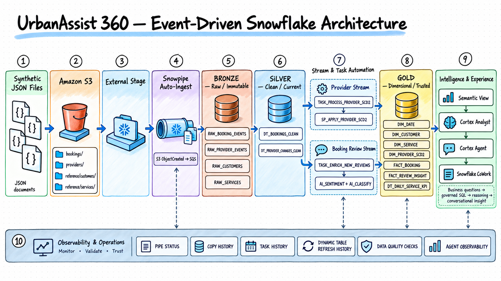
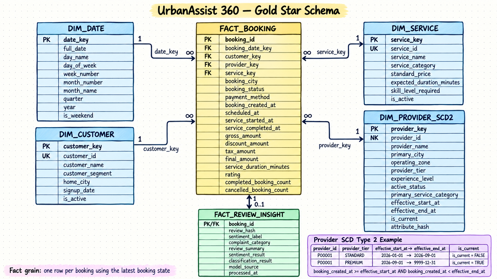

# UrbanAssist 360

UrbanAssist 360 is a Snowflake-native reference implementation for an
event-driven home-services analytics platform. It ingests booking and provider
changes from Amazon S3, preserves raw history, builds a dimensional model,
enriches customer feedback with Snowflake AI Functions, and exposes governed
metrics through Cortex Analyst, a Cortex Agent, and Snowflake CoWork.

The repository is designed for direct execution from a Git-connected Snowflake
Workspace. It does not require a local deployment framework or a CI/CD service.

## Problem statement

A home-services marketplace receives booking snapshots and provider profile
changes throughout the day. Operations teams need timely answers to questions
about revenue, cancellations, provider performance, ratings, service duration,
and customer complaints. Raw JSON alone cannot answer those questions reliably:
booking updates must be deduplicated, provider history must be preserved, AI
outputs must be processed once and stored, and every natural-language answer
must use governed metric definitions.

UrbanAssist 360 solves that problem with a small number of clearly separated
Snowflake objects:

- Snowpipe reacts to S3 object-created notifications.
- Bronze tables preserve the incoming JSON and file metadata.
- Dynamic Tables maintain typed Silver records and Gold aggregates.
- Streams and Tasks run stateful provider SCD2 and AI-enrichment logic.
- A Gold star schema provides consistent analytical grain and joins.
- A Semantic View defines business terms, relationships, and metrics.
- Cortex Analyst supplies governed text-to-SQL to a narrow Cortex Agent.
- Snowflake CoWork provides the business-facing conversational experience.

## What this implementation delivers

- 50,000 deterministic historical bookings plus a 1,000-booking live batch
- 5,000 customers, 250 providers, 20 services, and a calendar dimension
- Booking snapshot deduplication using `record_updated_at`
- Provider SCD Type 2 history with half-open effective date ranges
- Stored AI sentiment and complaint-category results
- One row per latest booking in `GOLD.FACT_BOOKING`
- Daily service KPIs by date, city, and category
- Executable reconciliation, integrity, and pipeline-health checks
- A governed Semantic View with verified queries
- A Cortex Agent ready to add to Snowflake CoWork
- A repeatable event-driven demonstration using two held-back S3 files

## End-to-end architecture



The two event streams have different responsibilities:

1. Booking snapshots are deduplicated declaratively in a Silver Dynamic Table.
   New reviews are detected by a stream and enriched through a Task.
2. Provider snapshots are loaded to Bronze and applied to the provider dimension
   by a Task that closes the previous version and inserts a new SCD2 version.

## Data maintained in each medallion layer

The medallion layers describe how the same business events become progressively
more useful. Bronze answers **what arrived**, Silver answers **what is clean and
current**, and Gold answers **what the business can measure and analyze**.

The external stage, Snowpipes, Streams, procedures, and Tasks move or process
data; they are not additional medallion data layers.

### Source and landing area: Amazon S3 and the external stage

The source files contain synthetic home-services marketplace data in
gzip-compressed JSON Lines format:

| S3 data set | Source business event | Why it exists |
|---|---|---|
| Booking snapshots | A booking is created or its status, payment, timing, rating, or review changes | Reconstruct the latest operational state of every booking |
| Provider snapshots | A provider is created or a tracked profile attribute changes | Preserve which provider attributes were valid at a particular time |
| Customers | Customer master records | Describe who placed a booking and support customer-segment analysis |
| Services | Service catalogue records | Describe what was booked and support category, price, and duration analysis |

`OPS.URBANASSIST_S3_STAGE` is a named pointer to the project prefix in S3. It
does not copy or transform the files by itself. `BOOKING_EVENTS_PIPE` and
`PROVIDER_EVENTS_PIPE` load newly created S3 objects into the corresponding
Bronze tables. Customer and service reference files are loaded with controlled
`COPY INTO` statements.

### Bronze: complete source history

Bronze tables are append-only landing tables. Their `payload` column retains the
complete source JSON, while `source_filename`, `source_row_number`, and
`ingested_at` provide ingestion traceability.

| Bronze table | Row grain | Business data retained | Business purpose |
|---|---|---|---|
| `BRONZE.RAW_BOOKING_EVENTS` | One row per physical booking snapshot received | Booking and related customer, provider, and service IDs; city; status; operational timestamps; amounts; payment method; rating; review; source update time | Retain every state received for a booking so that late or repeated snapshots can be reconciled without losing the source history |
| `BRONZE.RAW_PROVIDER_EVENTS` | One row per physical provider snapshot received | Provider identity, city, operating zone, tier, experience level, active status, primary service category, and effective timestamp | Retain the evidence required to create historical provider versions |
| `BRONZE.RAW_CUSTOMERS` | One row per customer source record | Customer identity, name, segment, home city, signup date, and active flag | Land the customer master used to describe booking behavior |
| `BRONZE.RAW_SERVICES` | One row per service source record | Service identity, name, category, standard price, expected duration, required skill level, and active flag | Land the catalogue used to analyze demand and performance by service |

Bronze can contain multiple rows for the same business identifier. For example,
one booking can arrive as `BOOKED`, later as `IN_PROGRESS`, and finally as
`COMPLETED`. All three rows remain in `RAW_BOOKING_EVENTS`.

### Silver: typed and trustworthy operational data

Silver Dynamic Tables parse the JSON, standardize text, convert data types,
reject unusable records, and expose a stable structure for downstream logic.

| Silver table | Row grain | Data maintained | Business meaning |
|---|---|---|---|
| `SILVER.DT_BOOKINGS_CLEAN` | One latest valid row per `booking_id` | Typed booking keys, city, lifecycle timestamps, latest status, financial amounts, payment method, rating, review, last source update time, and source metadata | The latest trusted state of each logical booking; this is the source for the booking fact |
| `SILVER.DT_PROVIDER_CHANGES_CLEAN` | One row per valid provider source event | Standardized provider attributes, effective timestamp, source metadata, and a hash of the six SCD2-tracked attributes | A clean sequence of provider states from which initial and historical provider versions can be built |

For bookings, the latest `record_updated_at` wins. Therefore, approximately
55,000 historical physical booking snapshots become 50,000 logical bookings in
`DT_BOOKINGS_CLEAN`. A new booking snapshot automatically causes the Dynamic
Table result to be reevaluated.

The provider attribute hash covers city, operating zone, tier, experience
level, active status, and primary service category. It represents only those
tracked attributes; it is not a checksum of the entire data set.

Customer and service records intentionally move directly from Bronze into
Type 1 Gold dimensions through `MERGE` statements. A separate Silver table for
each small reference data set would add objects without demonstrating another
transformation pattern in this project.

### Gold: dimensional business model

Gold converts operational records into facts, dimensions, AI insights, and
reusable aggregates. These are the tables intended for analytics and the
semantic layer.

| Gold table | Row grain | Data maintained | Business meaning |
|---|---|---|---|
| `GOLD.DIM_DATE` | One row per calendar date | Day, week, month, quarter, year, and weekend attributes | Provides consistent calendar filtering and grouping |
| `GOLD.DIM_CUSTOMER` | One row per customer | Customer name, segment, home city, signup date, and current active flag | Describes who placed each booking; maintained as Type 1 because only the latest customer description is required |
| `GOLD.DIM_SERVICE` | One row per service | Service name, category, standard price, expected duration, required skill level, and current active flag | Describes what was booked; maintained as Type 1 catalogue data |
| `GOLD.DIM_PROVIDER_SCD2` | One row per historical version of a provider | Version-specific provider attributes, effective start/end timestamps, current-version flag, and attribute hash | Preserves the provider tier, zone, experience, status, and service category that were valid when a booking occurred |
| `GOLD.FACT_BOOKING` | One row per logical booking using its latest booking state | Dimension keys, booking status and timestamps, amounts, duration, rating, completion indicator, and cancellation indicator | Central transaction table for revenue, volume, cancellation, duration, rating, customer, service, and provider analysis |
| `GOLD.FACT_REVIEW_INSIGHT` | One row per latest reviewed booking processed by AI | Review hash, sentiment, complaint category, raw AI results, model source, and processing time | Makes customer-feedback themes reusable without running AI functions for every analytical query |
| `GOLD.DT_DAILY_SERVICE_KPI` | One row per booking date, booking city, and service category | Booking counts, completion and cancellation rates, revenue, average rating, AI coverage, and negative-review count | Provides a ready-to-query daily operational summary for dashboards and natural-language questions |

`DIM_CUSTOMER` and `DIM_SERVICE` are Type 1 dimensions: a changed description
updates the existing business member. `DIM_PROVIDER_SCD2` is Type 2: a changed
tracked attribute closes the previous version and inserts a new version, so
historical analysis remains accurate.

### Processing objects supporting the layers

The project contains two Snowflake Streams, but they solve different business
problems:

| Processing path | What the Stream detects | What the Task does | Stored result |
|---|---|---|---|
| Booking review path | New rows appended to `RAW_BOOKING_EVENTS` after the historical AI initialization | Selects the latest changed reviews and calls Snowflake AI Functions for sentiment and complaint classification | Upserts `GOLD.FACT_REVIEW_INSIGHT` |
| Provider SCD2 path | New rows appended to `RAW_PROVIDER_EVENTS` after the initial provider dimension is seeded | Closes the current provider version and inserts a new version when tracked attributes changed | Updates `GOLD.DIM_PROVIDER_SCD2` |

The booking Stream does not deduplicate `FACT_BOOKING`—the
`DT_BOOKINGS_CLEAN` Dynamic Table performs that job. Similarly,
`DT_PROVIDER_CHANGES_CLEAN` standardizes provider events, while the provider
Task and procedure perform the stateful close-and-insert operations needed for
SCD2 history.

### End-to-end table lineage

```text
S3 booking snapshots
    -> BRONZE.RAW_BOOKING_EVENTS
       -> SILVER.DT_BOOKINGS_CLEAN
          -> GOLD.FACT_BOOKING
             -> GOLD.DT_DAILY_SERVICE_KPI
       -> OPS.BOOKING_REVIEW_STREAM + TASK_ENRICH_NEW_REVIEWS
          -> GOLD.FACT_REVIEW_INSIGHT
             -> GOLD.DT_DAILY_SERVICE_KPI

S3 provider snapshots
    -> BRONZE.RAW_PROVIDER_EVENTS
       -> SILVER.DT_PROVIDER_CHANGES_CLEAN       (clean provider events/initial seed)
       -> OPS.PROVIDER_EVENTS_STREAM + TASK_PROCESS_PROVIDER_SCD2
          -> GOLD.DIM_PROVIDER_SCD2
             -> GOLD.FACT_BOOKING

S3 customer reference
    -> BRONZE.RAW_CUSTOMERS
       -> GOLD.DIM_CUSTOMER
          -> GOLD.FACT_BOOKING

S3 service reference
    -> BRONZE.RAW_SERVICES
       -> GOLD.DIM_SERVICE
          -> GOLD.FACT_BOOKING

Generated calendar rows
    -> GOLD.DIM_DATE
       -> GOLD.DT_DAILY_SERVICE_KPI
```

## Gold data model



The model is centered on `FACT_BOOKING`. Its grain is one row per booking using
the latest booking state. Each row points to one date, customer, service, and the
historically correct provider version through surrogate keys.

| Relationship | Cardinality | Join meaning |
|---|---|---|
| `DIM_DATE` to `FACT_BOOKING` | One date to many bookings | The calendar date on which the booking was created |
| `DIM_CUSTOMER` to `FACT_BOOKING` | One customer to many bookings | The customer who placed the booking |
| `DIM_SERVICE` to `FACT_BOOKING` | One service to many bookings | The service requested in the booking |
| `DIM_PROVIDER_SCD2` to `FACT_BOOKING` | One provider version to many bookings | The version of the provider profile effective when the booking was created |
| `FACT_BOOKING` to `FACT_REVIEW_INSIGHT` | One booking to zero or one review insight | Optional AI interpretation when the latest completed booking has review text |

Provider history is resolved using the half-open interval:

```text
effective_start_at <= booking_created_at < effective_end_at
```

For example, if provider `P010` was `STANDARD` until 1 June and `PREMIUM`
afterward, a May booking points to the Standard provider row and a June booking
points to the Premium provider row. Current provider attributes therefore do
not rewrite historical booking analysis.

The resulting Gold model can answer business questions such as:

- Which city or service category produces the most revenue?
- Where are cancellation rates increasing?
- How do provider tier and experience relate to completion rate or rating?
- Which customer segments book particular service categories?
- What complaint themes appear most frequently in negative reviews?
- Is actual service duration materially different from expected duration?

## Repository layout

```text
urbanassist360-snowflake-dev/
├── README.md
├── config/
│   └── project.env.example
├── data/
│   ├── README.md
│   ├── EXPECTED_PATTERNS.md
│   └── generated/
├── docs/
│   ├── RUNBOOK.md
│   ├── DATA_DICTIONARY.md
│   ├── DIAGRAM_PROMPTS.md
│   └── diagrams/
│       ├── architecture.png
│       └── data-model.png
├── scripts/
│   └── generate_data.py
└── sql/
    ├── README.md
    ├── 00_setup/
    │   ├── 01_account_and_roles.sql
    │   ├── 02_s3_storage_integration.sql
    │   └── 03_github_workspace_integration.sql
    ├── 01_bronze/
    │   ├── 01_stage_and_raw_tables.sql
    │   ├── 02_snowpipe_auto_ingest.sql
    │   └── 03_initial_reference_load.sql
    ├── 02_silver/
    │   └── 01_clean_dynamic_tables.sql
    ├── 03_gold/
    │   ├── 01_dimensions.sql
    │   ├── 02_provider_scd2_automation.sql
    │   ├── 03_review_ai_enrichment.sql
    │   └── 04_booking_fact_and_kpis.sql
    ├── 04_intelligence/
    │   ├── 01_semantic_view.sql
    │   ├── 02_cortex_agent.sql
    │   └── 03_cowork_access.sql
    └── 05_operations/
        ├── 01_monitoring_and_validation.sql
        ├── 02_live_event_demo.sql
        └── 03_cleanup.sql
```

The folder number identifies the architectural phase. File numbers restart
inside each folder and define the execution order for that phase. Every SQL file
begins with its role, prerequisites, and purpose, and each executable statement
has an adjacent comment explaining its effect.

## Connect GitHub to a Snowflake Workspace

The recommended interactive-development setup uses the Snowflake GitHub App
OAuth flow. Developers authorize GitHub in the Workspace UI, so a personal
access token does not need to be written into SQL or stored in a Snowflake
secret.

### Prerequisites

- Create the GitHub repository and add at least one commit. Snowflake cannot
  create a Git Workspace from an empty repository.
- Copy the repository's HTTPS URL, for example
  `https://github.com/acme-data/urbanassist360-snowflake-dev`.
- Decide which existing branch to use, or create a development branch in the
  Workspace after it is connected.
- Ensure the account administrator can create API integrations. If a GitHub
  organization restricts app installation, its administrator must also approve
  the Snowflake GitHub App.

### One-time Snowflake account configuration

Run `sql/00_setup/01_account_and_roles.sql` first, or otherwise ensure that the
`URBANASSIST_ENGINEER` role exists. Then open a regular Snowflake SQL worksheet,
replace both GitHub placeholders, and run
`sql/00_setup/03_github_workspace_integration.sql`.

The essential commands from that file are:

```sql
-- Creating the account-level integration is normally an administrator action.
USE ROLE ACCOUNTADMIN;

-- Restrict OAuth access to this repository rather than all of github.com.
CREATE OR REPLACE API INTEGRATION URBANASSIST_GITHUB_API_INT
  API_PROVIDER = GIT_HTTPS_API
  API_ALLOWED_PREFIXES = (
    'https://github.com/<GITHUB_OWNER>/<GITHUB_REPOSITORY>'
  )
  API_USER_AUTHENTICATION = (
    TYPE = SNOWFLAKE_GITHUB_APP
  )
  ENABLED = TRUE
  COMMENT = 'OAuth connection from Snowflake Workspaces to the UrbanAssist GitHub repository';

-- Make the integration selectable by developers using the project role.
GRANT USAGE
  ON INTEGRATION URBANASSIST_GITHUB_API_INT
  TO ROLE URBANASSIST_ENGINEER;

-- Confirm the allowed URL, OAuth type, and enabled state.
DESCRIBE INTEGRATION URBANASSIST_GITHUB_API_INT;
```

Do not replace the placeholders with an SSH URL such as `git@github.com:...`.
Snowflake Git connections use the repository's HTTPS origin.

### Create the Git-connected Workspace

There is no `CREATE WORKSPACE` SQL command in this workflow. Complete this part
in Snowsight:

1. Sign in with the developer who will work on the project and switch to
   `URBANASSIST_ENGINEER`.
2. Open **Projects → Workspaces**.
3. Select **From Git repository**.
4. Paste the GitHub HTTPS repository URL.
5. Select `URBANASSIST_GITHUB_API_INT` as the API integration.
6. Complete the Snowflake GitHub App authorization when prompted. Select only
   the account or organization repositories required for this project.
7. Name the Workspace and complete its creation.
8. Open the **Changes** view, select the repository/branch menu, and either
   switch to the intended remote branch or select **New** to create a branch.
9. Confirm that `urbanassist360-snowflake-dev/README.md` and the layer-oriented `sql/`
   folders are visible before executing project files.

Normal development then follows this loop:

```text
Fetch/Pull → edit or run SQL → review Changes → commit → push
```

The Git integration synchronizes source files; it does not automatically run
the SQL. Execute the files manually in the order below while using the role
shown in each file header.

## Execution order

Follow the [complete runbook](docs/RUNBOOK.md). The abbreviated sequence is:

| Order | File | Purpose | Principal context |
|---:|---|---|---|
| 1 | `sql/00_setup/01_account_and_roles.sql` | Role, warehouse, database, schemas | Account admin, then project role |
| 2 | `sql/00_setup/02_s3_storage_integration.sql` | Snowflake trust object for S3 | Project role |
| Optional | `sql/00_setup/03_github_workspace_integration.sql` | One-time GitHub OAuth integration; run before creating the Git Workspace | Account admin |
| 3 | `sql/01_bronze/01_stage_and_raw_tables.sql` | File format, stage, raw tables | Project role |
| 4 | `sql/01_bronze/02_snowpipe_auto_ingest.sql` | Auto-ingest pipes and queue ARNs | Project role |
| 5 | `sql/01_bronze/03_initial_reference_load.sql` | Reference COPY and missed-file recovery | Project role |
| 6 | `sql/02_silver/01_clean_dynamic_tables.sql` | Typed, deduplicated Silver state | Project role |
| 7 | `sql/03_gold/01_dimensions.sql` | Date, customer, service, provider seed | Project role |
| 8 | `sql/03_gold/02_provider_scd2_automation.sql` | Provider Stream, procedure, and Task | Project role |
| 9 | `sql/03_gold/03_review_ai_enrichment.sql` | Historical AI sample and live AI Task | Project role |
| 10 | `sql/03_gold/04_booking_fact_and_kpis.sql` | Booking fact and daily KPIs | Project role |
| 11 | Runbook sections 17–19 (Snowsight UI) | Semantic View, Cortex Analyst tool, Agent, and CoWork | Project role, then account admin for CoWork |
| Reference only | `sql/04_intelligence/*.sql` | Version-controlled definitions and troubleshooting fallback; do not run for the UI path | As stated in each file |
| 12 | `sql/05_operations/01_monitoring_and_validation.sql` | Health and quality gates | Project role |
| 13 | `sql/05_operations/02_live_event_demo.sql` | Held-back file walkthrough | Project role |

Do not upload `booking_live_batch.json.gz` or
`provider_changes_live.json.gz` until
`sql/05_operations/02_live_event_demo.sql` tells you to do so. The Streams are
intentionally created after the historical load, making the live change set
small, fast, and easy to inspect.

## Expected stable state

Before the live files arrive:

| Object | Expected logical rows |
|---|---:|
| `GOLD.DIM_CUSTOMER` | 5,000 |
| `GOLD.DIM_SERVICE` | 20 |
| Current provider versions | 250 |
| `SILVER.DT_BOOKINGS_CLEAN` | 50,000 |
| `GOLD.FACT_BOOKING` | 50,000 |
| Historical AI enrichment | Up to configured limit, default 1,000 |

After the live files and Tasks complete:

- The booking fact contains 51,000 logical bookings.
- Thirty provider changes are evaluated; only changed hashes produce versions.
- Every provider still has exactly one current version.
- New reviewed bookings receive sentiment and complaint classification.
- The daily KPI table contains September 2026 activity.

## Cost and safety boundaries

- The warehouse is X-Small and auto-suspends after 60 seconds.
- Dynamic Table target lags are five and ten minutes, not sub-minute polling.
- The historical AI backfill defaults to 1,000 reviews.
- AI results are persisted with a review hash to avoid unchanged reprocessing.
- Cleanup statements are commented out and require explicit review.
- The storage integration is read-only and restricted to one S3 prefix.
- No real customer or provider information is present in the source files.
- Cross-region inference is not enabled automatically; account owners must make
  that governance decision explicitly if their local region lacks a model.

## Documentation

- [Implementation runbook](docs/RUNBOOK.md)
- [Data dictionary and lineage](docs/DATA_DICTIONARY.md)
- [Diagram generation specifications](docs/DIAGRAM_PROMPTS.md)
- [Source-data instructions](data/README.md)
- [Expected analytical patterns](data/EXPECTED_PATTERNS.md)

## Reference documentation

- [Snowpipe auto-ingest for Amazon S3](https://docs.snowflake.com/en/user-guide/data-load-snowpipe-auto-s3)
- [Dynamic Tables](https://docs.snowflake.com/en/user-guide/dynamic-tables/overview)
- [Streams on Dynamic Tables](https://docs.snowflake.com/en/user-guide/dynamic-tables/streams-on-dts)
- [Cortex AI Functions](https://docs.snowflake.com/en/user-guide/snowflake-cortex/aisql)
- [Semantic Studio and Semantic View UI](https://docs.snowflake.com/en/user-guide/views-semantic/semantic-studio)
- [Create and manage Cortex Agents](https://docs.snowflake.com/en/user-guide/snowflake-cortex/cortex-agents-manage)
- [Snowflake CoWork access and Agent visibility](https://docs.snowflake.com/en/user-guide/snowflake-cortex/snowflake-cowork/deploy-agents)
- [Git-connected Workspaces](https://docs.snowflake.com/en/user-guide/ui-snowsight/workspaces-git)
- [Setting up Snowflake to use Git](https://docs.snowflake.com/en/developer-guide/git/git-setting-up)
